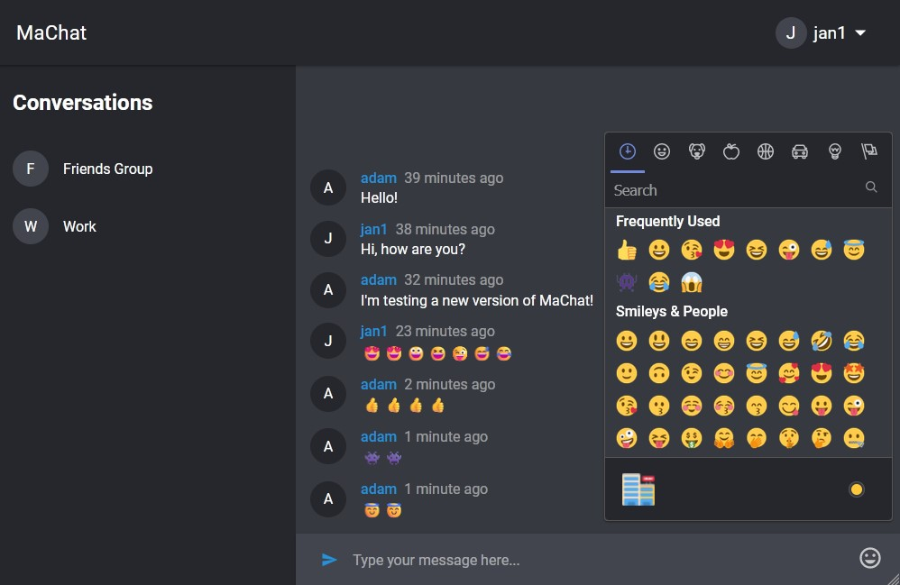

## MaChat

MaChat is a modern chat application built with React, Relay, and TypeScript.

Backend source: [https://github.com/moustaxx/machat-server](https://github.com/moustaxx/machat-server)

### Features

- **User Authentication**: Secure login and registration system with error handling.
- **Real-Time Messaging**: Send and receive messages instantly with WebSocket support.
- **Conversations Management**: View and manage your conversations in a user-friendly sidebar.
- **Dark Mode**: Toggle between light and dark themes for a personalized experience.
- **Desktop Notifications**: Get notified of new messages even when the app is minimized.
- **Emoji Support**: Add emojis to your messages using an integrated emoji picker.
- **Optimistic UI Updates**: Experience seamless interactions with optimistic updates for sending messages.
- **Pagination**: Efficiently load messages with infinite scrolling and pagination.
- **Error Handling**: Graceful error boundaries to handle unexpected issues.
- **Responsive Design**: Fully responsive layout for desktop and mobile devices.

### Screenshots

#### Landing Page


#### Chat Interface


### Technologies Used

- **Frontend**: React, TypeScript, CSS Modules
- **State Management**: React Context API
- **GraphQL**: Relay, Subscriptions
- **Backend Integration**: GraphQL API with WebSocket support
- **Build Tools**: Webpack, Babel
- **Testing**: Optimistic UI and error handling

### How to Run

1. Clone the repository:
   ```bash
   git clone https://github.com/moustaxx/machat.git
   cd machat
   ```

2. Install dependencies:
   ```bash
   npm install
   ```

3. Start the development server:
   ```bash
   npm start
   ```

4. Open the app in your browser at `http://localhost:8080`.